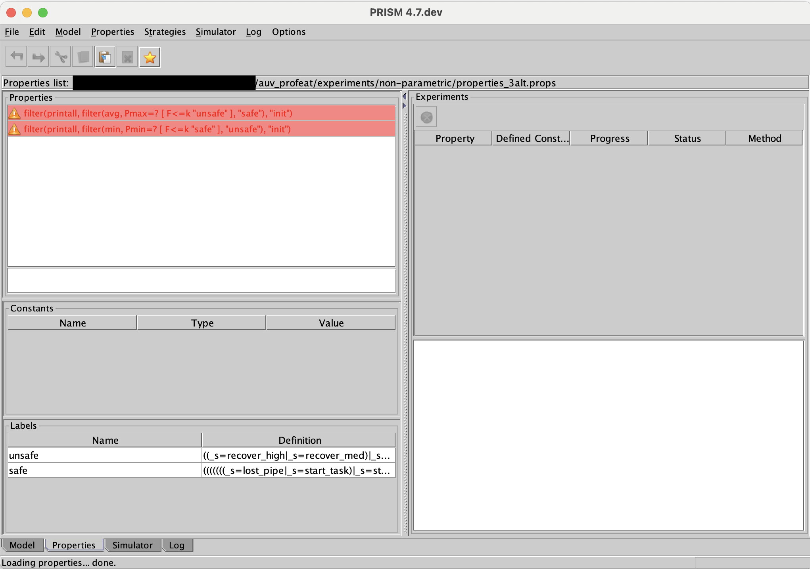
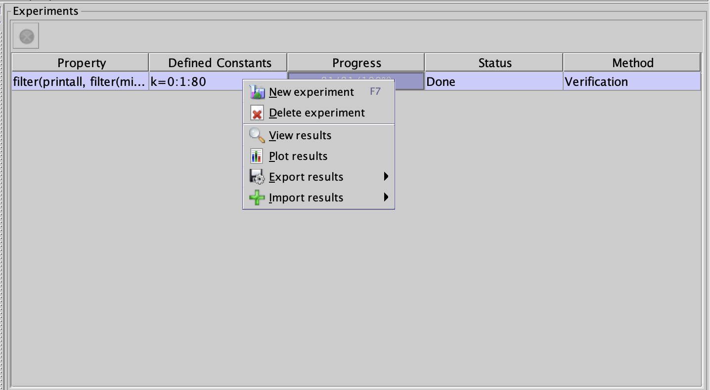

# Analysing Self-Adaptive Systems as Software Product Lines (Artifact)
This repository contains the implementation of a small-scale evaluation of an autonomous underwater vehicle (AUV) with the mission to find and inspect a pipeline located on a seabed which was inspired by the exemplar [SUAVE](https://doi.org/10.1109/SEAMS59076.2023.00031).
The small-scale evaluation in this repository is an extended version of the small-scale evaluation presented and published at iFM 2023, the paper can be found [here](https://doi.org/10.1007/978-3-031-47705-8_18). The artifact associated to the iFM 2023 paper was published as an original software publication in Science of Computer Programming, the publication can be found [here](https://doi.org/10.1016/j.scico.2024.103221) and the models [here](https://doi.org/10.5281/zenodo.8275532) or in the `scp-ifm_artifact` branch on [GitHub](https://github.com/remaro-network/auv_profeat). 
  
The goal of this artifact is to show how a self-adaptive system can be modelled and analysed with a probabilistic, feature guarded transition system and a controller switching between features. [ProFeat](https://pchrszon.github.io/profeat/) is used as a tool to show this approach. The artifact accompanies the paper "Analysing Self-Adaptive Systems as Software Product Lines", submitted to the special issue on Intelligent Software Product Lines of the Journal of Systems and Software. 

The artifact is available on [zenodo](https://doi.org/10.5281/zenodo.14230735) and on [GitHub](https://github.com/remaro-network/auv_profeat).

**Authors:** Juliane Päßler, Maurice H. ter Beek, Ferruccio Damiani, Einar Broch Johnsen, S. Lizeth Tapia Tarifa

## Navigate the README
- [Set-up](#set-up)
- [Replication Instructions and Examples of Usage](#replication-instructions-and-examples-of-usage)
    - [Run the Analysis](#run-the-analysis)
    - [Read the out.log File](#read-the-outlog-file)
    - [Change Scenarios](#change-scenarios)
    - [Replicate the PRISM Experiments](#replicate-the-prism-experiments)
- [Extend and Modify the Artifact](#extend-and-modify-the-artifact)
    - [PRISM Experiments](#prism-experiments)
- [Acknowledgements](#acknowledgements)

## Set-up
To run the model, [PRISM](https://www.prismmodelchecker.org/) and [ProFeat](https://wwwtcs.inf.tu-dresden.de/ALGI/PUB/ProFeat/doc/index.html) have to be installed. We recommend getting PRISM v4.7 and ProFeat v1.0.2.1 (commit id dfa7f03214bb92e7fd30f1402ff5a19dbdd5929c) from the respective Github repositories, the [PRISM Github repository](https://github.com/prismmodelchecker/prism/tree/v4.7) and the [ProFeat Github repository](https://github.com/pchrszon/profeat).

When both PRISM and ProFeat are installed, make them executable from anywhere or put them in the same folder. In the latter case, the commands below have to be run from the directory which includes the executables of PRISM and ProFeat, and the file names have to include the path to these files. Below, we will assume that PRISM and ProFeat are executable from anywhere.

## Replication Instructions and Examples of Usage

All analysis results documented in the paper can be replicated with the artifact. The results for the properties without experiments for Scenario 1 can be replicated by running the commands in [Run the Analysis](#run-the-analysis). To replicate the results for Scenario 2, the scenario has to be changed as described in [Change Scenarios](#change-scenarios) before running the commands in [Run the Analysis](#run-the-analysis). To replicate the results for unsafe states with PRISM experiments, follow the instructions in [Replicate the PRISM Experiments](#replicate-the-prism-experiments). 

### Run the Analysis
To replicate the results for the properties without experiments, navigate to the folder `auv_profeat` in the terminal. 
Then type the following.
```Bash
profeat -t casestudy.profeat casestudy.fprops
prism out.prism out.props > out.log
```
The first command translates the ProFeat model and the ProFeat property files to PRISM model and property files, the second command uses PRISM to compute the results which are saved in the `out.log` file. To view the results, open the `out.log` file which is saved in the `auv_profeat` folder.

If you want to analyse additional properties, include them in the `casestudy.fprops` file. Remember to include `${...}` around ProFeat specific constructs.

### Read the out.log File
The beginning of the `out.log` file should look like the following.
```Bash
PRISM
=====

Version: 4.7.dev
Date: xxx
Hostname: xxx
Memory limits: cudd=1g, java(heap)=1g
Command line: prism out.prism out.props

Parsing model file "out.prism"...

Type:        MDP
Modules:     _environment _hardware _auv _controller 
Variables:   _water_visib _sonar_failed _camera_failed _camera_blocked _s _d_insp _t_failed _robot_navigation_high _robot_navigation_low _robot_navigation_med _robot_navigation_very_high _robot_pipeline_inspection_follow _robot_pipeline_inspection_search _robot_vision_camera _robot_vision_sonar 

Parsing properties file "out.props"...

24 properties:
(1) filter(printall, Pmin=? [ F _s=done ], "init")
(2) filter(printall, Pmax=? [ F _s=done ], "init")
(3) filter(printall, Pmin=? [ F _s=abort_mission ], "init")
(4) filter(printall, Pmax=? [ F _s=abort_mission ], "init")
(5) filter(printall, Pmin=? [ !_sonar_failed U _s=done ], "init")
(6) filter(printall, Pmax=? [ !_sonar_failed U _s=done ], "init")
(7) filter(printall, Pmin=? [ !_camera_failed U _s=done ], "init")
(8) filter(printall, Pmax=? [ !_camera_failed U _s=done ], "init")
(9) filter(printall, Pmin=? [ !_camera_blocked U _s=done ], "init")
(10) filter(printall, Pmax=? [ !_camera_blocked U _s=done ], "init")
(11) filter(printall, P>=1.0 [ G (_camera_failed=>(F G !_robot_vision_camera_active)) ], "init")
(12) filter(printall, P>=1.0 [ G (_sonar_failed=>(F G !_robot_vision_sonar_active)) ], "init")
(13) filter(printall, P>=1.0 [ G (_camera_blocked=>(F (!_robot_vision_camera_active|!_camera_blocked))) ], "init")
(14) filter(printall, P>=1.0 [ G (_camera_blocked=>(F !_camera_blocked)) ], "init")
(15) filter(printall, P>=1.0 [ G ((_robot_vision_camera_active&_robot_pipeline_inspection_search_active&_water_visib<(max_visib-min_visib)/3)=>(F (_robot_navigation_low_active|_water_visib>=(max_visib-min_visib)/3))) ], "init")
(16) filter(printall, P>=1.0 [ G ((_robot_vision_camera_active&_robot_pipeline_inspection_search_active&_water_visib>=(max_visib-min_visib)/3&_water_visib<(2*(max_visib-min_visib))/3)=>(F (_robot_navigation_med_active|_robot_navigation_low_active|_water_visib>=(2*(max_visib-min_visib))/3))) ], "init")
(17) filter(printall, P>=1.0 [ G ((_robot_pipeline_inspection_search_active&!_sonar_failed)=>(F (_robot_vision_sonar_active|_sonar_failed))) ], "init")
(18) filter(printall, P>=1.0 [ G ((_robot_pipeline_inspection_follow_active&!(_camera_failed|_camera_blocked))=>(F (_robot_vision_camera_active|_camera_failed|_camera_blocked))) ], "init")
(19) filter(printall, R{"energy"}min=? [ F _s=done ], "init")
(20) filter(printall, R{"energy"}max=? [ F _s=done ], "init")
(21) filter(printall, R{"time"}min=? [ F _s=done ], "init")
(22) filter(printall, R{"time"}max=? [ F _s=done ], "init")
(23) filter(printall, Pmin=? [ G "safe" ], "init")
(24) filter(printall, Pmax=? [ F "unsafe" ], "init")
```
After a PRISM header, it specifies the model type, the modules and the variables of the PRISM file that was automatically translated from the ProFeat file. Then the analysed properties are listed. They are slightly different from the properties specified in `casestudy.fprops` because they have been translated to PRISM properties.

For each of the properties, the `out.log` file then includes a paragraph, separated by `----`, with the analysis results. For example, the paragraph for determining the minimum probability of finally reaching the state "done" should look like the following.
```Bash
---------------------------------------------------------------------

Model checking: filter(printall, Pmin=? [ F _s=done ], "init")

Building model...

Computing reachable states...

Reachability (BFS): 27 iterations in 0.04 seconds (average 0.001407, setup 0.00)

Time for model construction: 0.552 seconds.

Type:        MDP
States:      89820 (1 initial)
Transitions: 2976260
Choices:     308850

Transition matrix: 195736 nodes (1885 terminal), 2976260 minterms, vars: 27r/27c/19nd

Prob0E: 25 iterations in 0.05 seconds (average 0.001880, setup 0.00)

Prob1A: 2 iterations in 0.00 seconds (average 0.001000, setup 0.00)

yes = 2700, no = 41770, maybe = 45350

Computing remaining probabilities...
Engine: Hybrid

Building hybrid MTBDD matrices... [nm=61, levels=27, nodes=290237] [13.3 MB]
Adding sparse bits... [levels=27-27, num=61, compact=61/61] [14.4 MB]
Creating vector for yes... [dist=2, compact] [175.4 KB]
Allocating iteration vectors... [3 x 701.7 KB]
TOTAL: [29.9 MB]

Starting iterations...

Iterative method: 113 iterations in 2.01 seconds (average 0.012248, setup 0.63)

Results (including zeros) for filter "init":
36284:(6,false,false,false,11,0,0,0,0,0,1,0,1,0,1)=0.9622511424275723

Value in the initial state: 0.9622511424275723

Time for model checking: 2.089 seconds.

Result: 0.9622511424275723 (+/- 9.193913976757655E-6 estimated; rel err 9.55458878808208E-6)

---------------------------------------------------------------------
```
The result of the analyis (`Result`) can be found at the bottom of the paragraph, preceded by the time for model checking (`Time for model checking`).

### Change Scenarios
To change the scenario, open the file `auv_profeat/casestudy.profeat`, uncomment parameters of the scenario you want to run and comment the parameters of the other scenario. If you, for example, want to run Scenario 2, the beginning of `casestudy.profeat` should look like this:
```
mdp

// Scenario 1: Short pipeline inspection in the North Sea
//const int max_visib = 10;				// The maximum visibility
//const int min_visib = 1;				// The minimum visibility
//const double current_prob = 0.6;		// The probability of currents
//const int inspect = 10;					// The meters of pipeline that should be inspected
//const double camera_block_prob = 0.05;	// The probability the camera getting blocked (e.g. because of something in front of the camera)

// Scenario 2: Longer pipeline inspection in the Caribbean Sea
const int max_visib = 20;
const int min_visib = 3;
const double current_prob = 0.3;
const int inspect = 30;
const double camera_block_prob = 0.03;

// Scenario independent parameters
const int infl_tf = 10;				// The influence a thruster failure has on the path of the AUV. The bigger the value, the less influence a thruster failure has on the path (it can keep the path even in case of a thruster failure)
const double sonar_fail_prob = 0.01;	// The probability of a sonar failure
const double camera_fail_prob = 0.005;	// The probability of a camera failure
const double camera_unblock_prob = current_prob*0.8;	// The probability of the camera getting unblocked depends on the current probability
```
To create a new scenario, change the parameters `min_visib`, `max_visib`, `current_prob`, `inspect`, and `camera_block_prob`. You can also change the scenario independet parameters, namely, the influence the thruster failures have on the path of the AUV (`infl_tf`), the probability with which the sonar fails (`sonar_fail_prob`), the probability with which the camera fails (`camera_fail_prob`), and the probability with which the camera gets unblocked (`camera_unblock_prob`).

### Replicate the PRISM Experiments
The files for replicating the PRISM experiments for Scenarios 1 and 2 can be found in the folder `auv_profeat/experiments` as `scenario1.prism` and `scenario2.prism`, respectively. The necessary property file, containing the properties used for the experiments, is `experiments.props` in the same folder.

Open the PRISM GUI by opening the executable `xprism` that should have been downloaded when you downloaded PRISM. Open the model file of one of the two scenarios by going to `Model -> Open model` and selecting `scenario1.prism` or `scenario2.prism`. Parse and build the model by pressing `F2` and `F3`, respectively. To load the properties, go to the `Properties` Tab in the lower left corner. Open the properties list by going to `Properties -> Open properties list` and select `experiments.props`. 
The GUI should now look like the following.

The experiments will use a variable named `k` for the number of time steps. To declare this variable, make a double click in the `Constants` field and change the name from `C0` to `k`.

To run an experiment, click one of the properties and press `F7`. In the dialog that opens, first decide which range your parameter should have, i.e., how many time steps you want to consider; in the paper we display the graph with 300 time steps. Click on `Okay`, give the graph a name and either print it to an already existing graph or to a new one.

It is also possible to inspect the values that were calculated for the graph. To do that, in the `Experiments` part of xprism, do a right click on the property whose results you want to inspect and click on `View results` as shown in the picture below.



This will enable you to determine after how many time steps the probability for the respective property to be satisfied is above a certain threshold.

For more information about PRISM experiments, including how to run them from the command line, consult the [PRISM manual](https://www.prismmodelchecker.org/manual/RunningPRISM/Experiments).


## Extend and Modify the Artifact
The artifact can be modified and extended in different ways, some ideas are collected below.
- Explore new scenarios.
- Analyse different properties.
- Change the probabilites of the transitions.
- Introduce different environmental or internal parameters that can trigger adaptation, i.e., feature changes by the feature controller.
- Include new modules. This would probably also entail modifying or extending the synchronisation between the different modules and extending the feature controller.
- Make the feature model richer, including more functionalities of the AUV that can be changed during runtime. This would also include extending both the module for the AUV and the feature controller.
- Include new states in the AUV module, representing for example another task that the AUV has to do. This might also require extending the feature controller.


### PRISM Experiments
In the following, we describe how to run the PRISM experiments with modified parameters, a modified model, as well different properties.

#### Run experiments with different parameters
To run experiments with different scenario independet parameters, changing the influence a thruster failure has on the path of the AUV, the probability of a sonar or camera failure or of the camera getting unblocked, you can modify the values of `infl_tf`, `sonar_fail_prob`, `camera_fail_prob` and `camera_unblock_prob`, respectively, in the file `scenario1.prism` or `scenario2.prism`.
To introduce a different scenario, you can modify the values of the scenario dependent parameters in the file `scenario1.prism` or `scenario2.prism`. 

#### Run experiments with a modified model
To run the PRISM experiments with a modified model, first run the analysis with the modified model as described in [Run the Analysis](#run-the-analysis). The obtained file `out.prism`, has to be modified such that the PRISM variables are initialised after their declaration and not in an `init ... endinit` block. 
That is, in the file `out.prism`, the block
```Bash
init
    ((((((((((((((1 <= ((_robot_navigation_high + _robot_navigation_low) + _robot_navigation_med) + _robot_navigation_very_high & ((_robot_navigation_high + _robot_navigation_low) + _robot_navigation_med) + _robot_navigation_very_high <= 1) & (1 <= _robot_pipeline_inspection_follow + _robot_pipeline_inspection_search & _robot_pipeline_inspection_follow + _robot_pipeline_inspection_search <= 1)) & (0 <= _robot_vision_camera + _robot_vision_sonar & _robot_vision_camera + _robot_vision_sonar <= 1)) & (_robot_pipeline_inspection_follow = 1 => _robot_navigation_low = 1)) & (_robot_vision_camera = 1 => !_robot_navigation_very_high = 1)) & _robot_navigation_very_high_active) & _robot_pipeline_inspection_search_active) & _robot_vision_sonar_active) & _camera_blocked = false) & _camera_failed = false) & _d_insp = 0) & _s = start_task) & _sonar_failed = false) & _t_failed = 0) & _water_visib = round((max_visib - min_visib) / 2)
endinit
```
has to be deleted and the initial values of the variables have to be inserted at the correct positions in the `out.prism` file. For the model used in this artifact, it should look like the following.
```Bash
... 
module _environment
    _water_visib : [min_visib .. max_visib] init round((max_visib-min_visib)/2);
... 
module _hardware
    _sonar_failed : bool init false;
    _camera_failed : bool init false;
    _camera_blocked : bool init false;
...
module _auv
    _s : [0 .. 15] init 11;
    _d_insp : [0 .. inspect] init 0;
    _t_failed : [0 .. infl_tf] init 0;
... 
module _controller
    _robot_navigation_high : [0 .. 1] init 0;
    _robot_navigation_low : [0 .. 1] init 0;
    _robot_navigation_med : [0 .. 1] init 0;
    _robot_navigation_very_high : [0 .. 1] init 1;
    _robot_pipeline_inspection_follow : [0 .. 1] init 0;
    _robot_pipeline_inspection_search : [0 .. 1] init 1;
    _robot_vision_camera : [0 .. 1] init 0;
    _robot_vision_sonar : [0 .. 1] init 1;
... 
```
where `init` is the keyword for initialising a variable. 
Note that the variables of the ProFeat model have a preceding `_` in the PRISM model.

In the above example, the water visibility is initialised with `round((max_visib-min_visib)/2)`, the variables `sonar_failed`, `camera_failed` and `camera_blockd` with `false`, and the initial value of state `s` is `11`, which corresponds to the state `start_task`. The variables `d_insp` and `t_failed` are both initialised with `0`.

The features of the feature model that can be activated and deactivated during runtime are represented as variables in the PRISM model. The variable `_robot_navigation_high` in the above example, for example, corresponds to the feature `high` which is a subfeature if `navigation` that is a subfeature of `robot`. The "feature variables" initialised with `0` are inactive at the beginning, the ones initialised with `1` are active.

#### Run experiments with other properties
To run PRISM experiments with different properties, run the commands in [Run the Analysis](#run-the-analysis) with your modified property file to obtain the corresponding `.props` file. The ProFeat property file used for the experiments in the paper can be found in `auv_profeat/experiments` as `casestudy_experiments.fprops` in case you want to use it as a template. If you do not want to modify the model, you can use the `scenario1.prism` or `scenario2.prism` file in the `auv_profeat/experiments` folder as a model file for the experiments.
Then follow the steps for replicating the experiments in [Replicate the PRISM Experiments](#replicate-the-prism-experiments).

## Acknowledgements
We would like to thank Clemens Dubslaff for explaining ProFeat and its usage to us, and for answering numerous questions. 
<a href="https://remaro.eu/">
    
</a>

This work is part of the Reliable AI for Marine Robotics (REMARO) Project. For more information, please visit: <a href="https://remaro.eu/">https://remaro.eu/

<br>

<a href="https://research-and-innovation.ec.europa.eu/funding/funding-opportunities/funding-programmes-and-open-calls/horizon-2020_en">
    
</a>

This project has received funding from the European Union's Horizon 2020 research and innovation programme under the Marie Skłodowska-Curie grant agreement No. 956200.